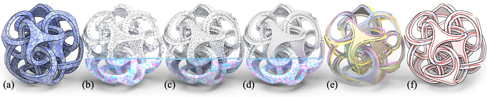

# MATStruct: High-Quality Medial Mesh Computation via Structure-aware Variational Optimization :star2: SIGGRAPH Asia 2025

:lemon: [[**MATStruct Project**](https://ningnawang.github.io/projects/2025_matstruct/)] :lemon: [[**MATStruct Paper** (low res)](https://arxiv.org/pdf/2510.10751)] :lemon: [[**MATStruct Code**](https://github.com/ningnawang/MATStruct)] :lemon: 




## Related Projects:
1. **SIGGRAPH Asia 2022** project **MATFP: Computing Medial Axis Transform with Feature Preservation via Restricted Power Diagram** preserves the features of 3D CAD models.

:cactus: [[**MATFP Project**](https://ningnawang.github.io/projects/2022_matfp/)]  :cactus: [[**MATFP Paper** (low res)](https://arxiv.org/abs/2210.13676)] :cactus: [[**MATFP Video** (YouTube)](https://youtu.be/0kP_EMtER-w?si=CyLhzKGUlTysoEUN)]  :cactus: [[**MATFP Video** (Bilibili)](https://www.bilibili.com/video/BV11hxqeqEcS/?share_source=copy_web&vd_source=085704da2cca04123412fb29bb28af85)]

2. **SIGGRAPH Asia 2024** project **MATTopo: Topology-preserving Medial Axis Transform with Restricted Power Diagram** preserves the topology of 3D CAD models.

:pineapple: [[**MATTopo Project**](https://ningnawang.github.io/projects/2024_mattopo/)] :pineapple: [[**MATTopo Paper** (low res)](https://arxiv.org/abs/2403.18761)] :pineapple: [[**MATTopo Code**](https://github.com/ningnawang/MATTopo)] :pineapple: [[**MATTopo Video** (YouTube)](https://www.youtube.com/watch?v=8AxJYVtU0SA)] :pineapple: [[**MATTopo Video** (Bilibili)](https://www.bilibili.com/video/BV1ZKxNeeEPF/?share_source=copy_web&vd_source=085704da2cca04123412fb29bb28af85)]


## Dependencies:

1. Please make sure following libs are up-to-date:

```
apt install zlib1g-dev
sudo apt install mesa-common-dev
sudo apt-get install libcgal-dev
```

2. This project heavily relies on sub-modules in **extern/libmat**, please make sure **[LibMAT](https://github.com/ningnawang/libmat.git)** exists and is runnable. Normally you don't need to do anything with it, linux command `$cmake ..` will do the work for you (see Section **Build**).

3. Please also install following dependencies:
    * CMake
    * CGAL 5.0.2-3
    * Eigen3
    * CUDA

## Build

This project has been tested on one Linux machines. 
Please build our code using **CMake**.

- Machine 1: GPU GeForce RTX 2080Ti
* Ubuntu 20.04
* Nvidia driver 525
* CUDA 11.8
* GCC 9.4.0
* CMake 3.16.3
* Geogram v1.7.5


For Linux, use the following steps to build:

```bash
mkdir build
cd build
cmake ..
make -j4
```

## Usage

The input of our method is the tetrahedral mesh in **.msh** format, one can use the [ftetwild](https://github.com/wildmeshing/fTetWild) to generate.

1. For running **NON-CAD** model (organic models), please run:
```bash
$  ./bin/VolumeVoronoiGPU -i <tet_mesh.msh> -o
```
For example:
```bash
$  ./bin/VolumeVoronoiGPU -i ../data_test/chair.off_.msh -o
```

2. For running **CAD** model with sharp edges and corners predetected (handled in the code), please run:
```bash
$  ./bin/VolumeVoronoiGPU -i <tet_mesh.msh>
```

For example:
```bash
$  ./bin/VolumeVoronoiGPU -i ../data_test/chair.off_.msh 
```

Other options:

1. use `-i/--input` to give the input tet mesh in `.msh` format (generated by [ftetwild](https://github.com/wildmeshing/fTetWild)).
2. use `-p/--poisson <int>` to control the sampling density (default 40; larger values generate more samples). 
3. Add `-o/--organic` when running organic shapes to bypass CAD edge detection. 
4. For CAD models, sharp convex/concave edges feature detection sensitivity can be tuned with `--se/--convex <deg>` for the convex angle threshold (default 55 deg, higher is less sensitive) and `--ce/--concave <deg>` for the concave angle threshold (default 60 deg, higher is more sensitive).

## Output & Format

The result will be saved under the **out/${FILENAME}/mat/** folder. 

1. For **NON-CAD** model (organic models), we do not detect feature edges, so the output is just generated medial mesh in both **.ma** format and **.obj** format. 
2. For **CAD** model with sharp edges and corners predetected, in addition to medial mesh in both **.ma** format and **.obj** format, we also store:
    - internal feature in `mat_wire1_${FILENAME}.obj` 
    - external feature in `mat_wire2_${FILENAME}.obj` 
    - junction feature in `mat_junctions_${FILENAME}.xyz` 

### More about output format:

For the generated 3D medial mesh, there are three medial elements:
1. vertices, represents medial spheres.
2. edges, represents medial cones:
   - edges not shared by any faces (1D curves)
   - edges shared by at least one face
3. faces, represents medial slabs.

We provide a GUI in [polyscope](https://polyscope.run/) which shows the generated medial mesh at the end of the program.

To open a saved 3D medial mesh in format `*.ma` or `*.obj`, we recommend following option:

1. The **.ma** file is the commonly used MAT format:
```
numVertices numEdges numFaces
v x y z r
e v1 v2
f v1 v2 v3
```
One can load the *.ma file using **Blender** with an open-sourced [blender-mat-addon](https://github.com/songshibo/blender-mat-addon).

2. The header ofr **.obj** will show the statistics of all vertices, faces and edges. Here edges consists of two parts as described above.
```
element vertex xxx
...
element face xxx
...
element edge xxx
```

We recommend using **Blender** to view the 3D medial meshes' in obj format, as it shows correct statistics of not only vertices and faces, but also all edges, including 1d curves. If you open the obj/OBJ file with **MeshLab**, only vertices and faces shows correctly, however, 1D curves will **NOT** be shown/counted in MeshLab.


